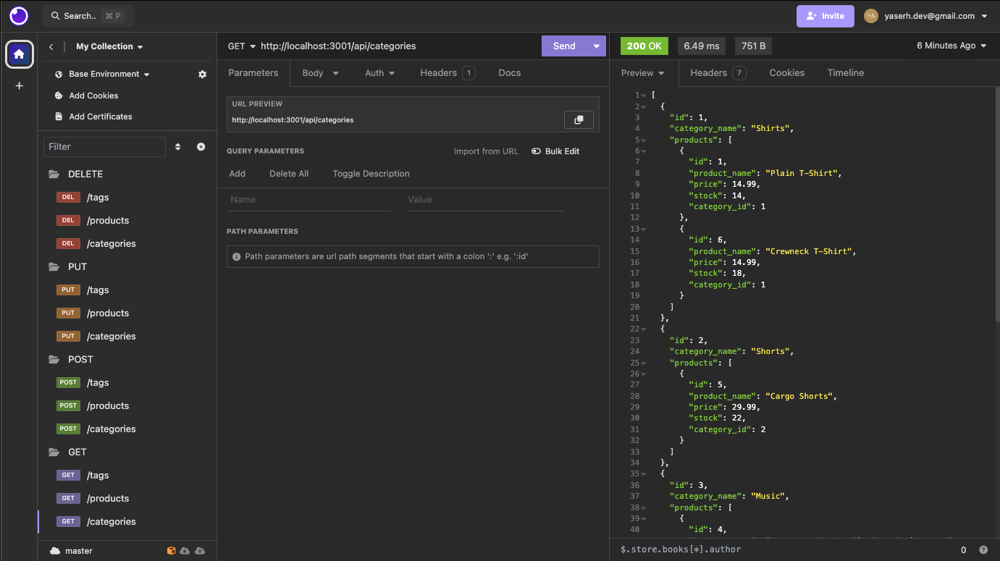

# ecommerce-backend
Week 13 Challenge

In this challenge I was given the task of editing a starter starter code so that the application is fully functional. It is a database for a e-commerce website and contains the following features:

- make GET, POST, PUT, and DELETE requests to the following endpoints:
    * /api/categories
    * /api/products
    * /api/tags


## Installation
To install this application, download the repository files and open the root folder in your command line. You will also need Node.js installed. Install all other dependencies using the following command:
```
npm i
```
Then to run the application, use the command: 
```
node server.js
```

## User Story
```
AS A manager at an internet retail company
I WANT a back end for my e-commerce website that uses the latest technologies
SO THAT my company can compete with other e-commerce companies
```

## Acceptance Criteria
```
GIVEN a functional Express.js API
WHEN I add my database name, MySQL username, and MySQL password to an environment variable file
THEN I am able to connect to a database using Sequelize
WHEN I enter schema and seed commands
THEN a development database is created and is seeded with test data
WHEN I enter the command to invoke the application
THEN my server is started and the Sequelize models are synced to the MySQL database
WHEN I open API GET routes in Insomnia for categories, products, or tags
THEN the data for each of these routes is displayed in a formatted JSON
WHEN I test API POST, PUT, and DELETE routes in Insomnia
THEN I am able to successfully create, update, and delete data in my database
```




Application available for download at: https://github.com/yaserhdev/ecommerce-backend

Demo video of application available at: https://youtu.be/5WWaX3tLIu0